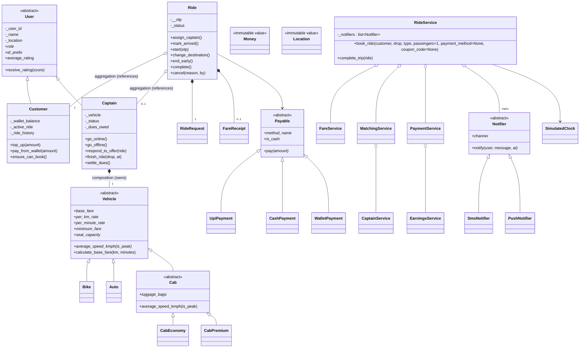
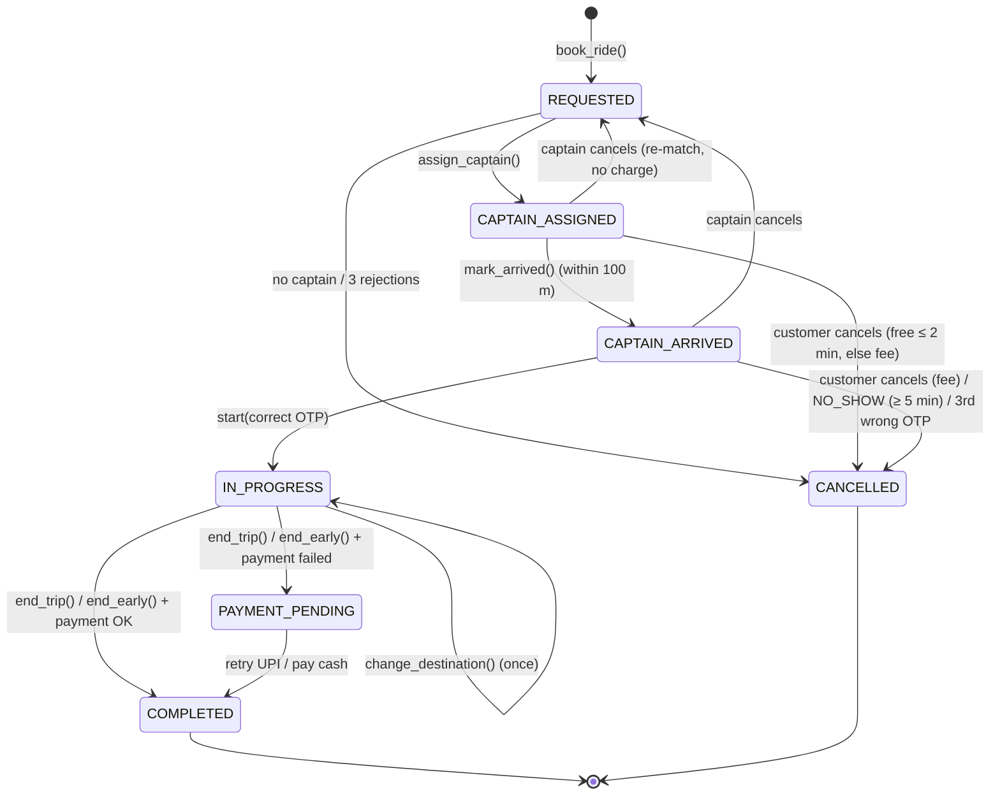

# Chennai Ride-Hailing App (Rapido-style) — Pure OOP in Python

A bike / auto / cab ride-hailing app that simulates **one full day in Chennai**, written to teach
core object-oriented programming to final-year engineering students. Every object keeps a consistent
state for the whole day: no teleporting, no double-booking, no time travel, and no money appearing or
disappearing.

The person who books is the **Customer**; the person who drives is the **Captain**.

## Setup

Only **Python 3.10+** is needed. There are no packages to install, no `requirements.txt`, and no frameworks.

```bash
python run.py            # start-up menu: 1 demo · 2 interactive mode · 3 self-check · 0 exit
python run.py --demo     # the simulated day (story-style console output)
python run.py --check    # the self-check: PASS/FAIL per rule, exit code 1 on any failure
python run.py --cli      # interactive mode (see below)
```

All commands work on Windows, macOS and Linux. `run.py` switches stdout to UTF-8 so that `₹`, `✔`
and `✘` print correctly in Windows consoles. The output is deterministic: OTPs and UPI outcomes come from
`random.Random` with fixed seeds, and all time comes from `SimulatedClock`.

## Project layout

```
run.py                          entry point (demo by default, --check for self-check)
ridehailing/
  exceptions.py                 RideHailingError + all specific exceptions
  model/
    common/     location.py, money.py, service_area.py, chennai_places.py
    user/       user.py (abstract), customer.py, captain.py, captain_status.py
    vehicle/    vehicle.py (abstract), bike.py, auto.py, cab.py (abstract),
                cab_economy.py, cab_premium.py, vehicle_type.py
    ride/       ride.py, ride_status.py, ride_request.py, fare_estimate.py,
                fare_receipt.py, cancellation_reason.py
    payment/    payable.py (abstract), upi_payment.py, cash_payment.py,
                wallet_payment.py, payment_status.py
  notification/ notifier.py (abstract), sms_notifier.py, push_notifier.py
  service/      customer_service.py, captain_service.py, matching_service.py, ride_service.py,
                fare_service.py, payment_service.py, rating_service.py, earnings_service.py
  time/         simulated_clock.py
  check/        self_check.py
  app/          chennai_ride_app.py (the simulated day)
  cli/          console_io.py, menu.py (abstract), cli_session.py, startup_menu.py, main_menu.py,
                customer_menu.py, captain_menu.py, operations_menu.py, clock_menu.py
walkthroughs/   ready-made class sessions (.txt input + .md teaching notes)
docs/
  OOP_CONCEPT_MAP.md            every OOP feature → exact file/class/method (the teaching script)
  FLOWS.md                      every business flow → the class and method that enforces it
  class_diagram.html            UML class diagrams generated from the code (open in a browser; needs internet for Mermaid)
  diagrams/*.mmd                the same five diagrams as reusable Mermaid sources
```

## Class diagram (inheritance + composition)



## Ride lifecycle (state diagram)



Every arrow is a method on `Ride`, and each method checks the current status first. Any other call
raises `InvalidRideStatusError`. `status` is a read-only property with no setter.

## What the demo shows

It simulates Monday, 28 September 2026, with 12 captains (one still KYC-pending) and 5 customers.
The scenes run in time order:

| Time | Scene |
|---|---|
| 6:00 AM | Captains come online; the KYC-pending captain is rejected |
| 8:15 AM | Priya compares all vehicle types, books a bike, pays by UPI (full receipt) |
| 8:40 AM | Chennai Central → Egmore auto with hotspot surge, cash; captain's dues rise |
| 9:10 AM | **Canonical:** Egmore → Tambaram cab; captain location before/after; next Egmore request goes elsewhere; Chromepet request goes to the captain now at Tambaram |
| 10:00 AM | Nearest captain rejects, next-nearest accepts (offer sequence printed) |
| 10:30 AM | Customer with an active ride tries to book again |
| 11:00 AM | Free cancel within 2 min; fee after grace, carried to the next ride |
| 12:30 PM | 4-minute wait (1 min charged) + previous cancellation fee on the receipt |
| 1:00 PM | Customer no-show after 5 minutes |
| 2:00 PM | One wrong OTP then correct; separate ride auto-cancelled after 3 wrong OTPs |
| 3:30 PM | Captain accepts then cancels; re-matched; customer not charged |
| 5:45 PM | Destination changed mid-ride; fare uses the actual route |
| 6:30 PM | Trip ended early; partial fare; both locations update |
| 7:00 PM | Wallet fails → UPI fails → PAYMENT_PENDING → booking blocked → cash → booking works |
| 8:00 PM | Cash dues cross ₹500 → blocked → settle → unblocked |
| 9:00 PM | No Cab Premium near Sholinganallur |
| 11:30 PM | Night Cab Premium from the Airport with FIRSTRIDE coupon, wallet; captain can't go offline mid-ride |
| — | Booking to Mahabalipuram rejected (outside service area) |
| End of day | Ratings (one captain flagged), earnings table, leaderboard, ride histories, position board, **Books Balanced ✔** |

## Interactive mode

Drive the app live, one action at a time, as a **customer**, a **captain** or the **operations team**.

```bash
python run.py --cli                                            # straight into interactive mode
python run.py                                                  # or choose 2 in the start-up menu
python run.py --cli < walkthroughs/01_egmore_to_tambaram.txt   # replay a scripted session
```

It starts from the **same seeded world as the demo**: same captains, customers, homes and seeds,
clock at 6:00 AM. Each session is fresh. OTPs and UPI outcomes are reproducible, so a replayed file
gives the same result every time. A status line sits above every menu:

```
[ 08:15 AM | Peak hour | Active rides: 2 | Online captains: 11 | Mode: Manual captain ]
```

**The CLI contains no business rules.** It reads input, calls the existing services and prints the
result. Radius matching, OTP, grace period, payments and the clock all come from the same model and
service objects that run the scripted day.

### Menu map

```
Start-up menu ─ 1 Demo · 2 Interactive mode · 3 Self-check · 0 Exit
└─ Main menu
   ├─ 1 Customer app   (pick a customer)
   │    1 Profile · 2 Top up · 3 Fare estimates · 4 Book · 5 Track · 6 Cancel · 7 Change destination
   │    8 End trip early · 9 Pay pending ride · 10 Rate last ride · 11 History · 12 Switch · 0 Back
   ├─ 2 Captain app    (pick a captain; ● = ride offer waiting)
   │    1 Profile · 2 Online/offline · 3 Incoming offer (accept/reject) · 4 Mark arrived · 5 Start (OTP)
   │    6 Complete · 7 Cancel / no-show · 8 Earnings · 9 Settle dues · 10 Rate customer · 11 Switch · 0 Back
   ├─ 3 Operations     1 Position board · 2 Live rides · 3 Nearby captains (✔/✘ + reason)
   │                   4 Surge at hotspots · 5 Notification log · 6 Earnings + books · 7 Flagged/blocked
   ├─ 4 Clock          1 Show · 2 Advance N minutes · 3 Jump to HH:MM (never backwards)
   ├─ 5 Settings       captain mode: Manual (default) / Auto
   └─ 0 Back to start-up menu
```

- **Manual captain mode:** a booked ride's offer waits (● in the captain list) until you switch to
  the Captain app to accept or reject it, then mark arrived, enter the OTP and complete.
- **Auto captain mode:** the captain accepts at once, drives over and starts with the correct OTP.
  You act only as the customer and use *Track active ride* to ride on to the drop.
- **Input handling:**
  - Places can be typed as a number or as part of a name (`tam` → Tambaram, `cent` → Chennai
    Central); several matches are listed for you to pick one. Mahabalipuram and Kanchipuram are listed
    as *(outside service area)* to demo that rejection.
  - At any prompt, `b` goes back and `q` quits (with confirmation). End of input exits gracefully.
  - Bad input re-prompts with a friendly message, and business errors print as `✘ ErrorName: message`.

### Class walkthroughs

| File | Shows |
|---|---|
| `walkthroughs/01_egmore_to_tambaram.txt` | Manual mode, full ride; afterwards the Tambaram captain is ✘ for Egmore and ✔ for Chromepet |
| `walkthroughs/02_cancellation_and_fee.txt` | Free cancel within 2 minutes; ₹20 fee after; fee on the next receipt |
| `walkthroughs/03_payment_pending.txt` | Low wallet → UPI fails → PAYMENT_PENDING → booking blocked → cash → booking works |
| `walkthroughs/04_night_ride.txt` | 11:30 PM Airport → Anna Nagar Cab Premium: night charge + FIRSTRIDE, Auto mode |

Each `.txt` has a matching `.md` that explains, step by step, what to show the students.

## Class exercise

**Rapido Parcel** is intentionally *not* built. In class, students add it by extending the
existing classes.
