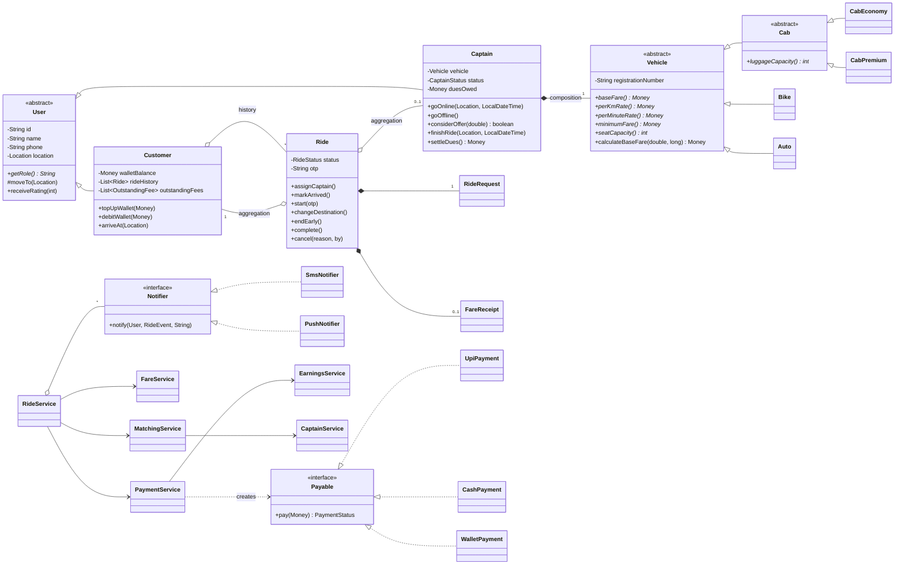
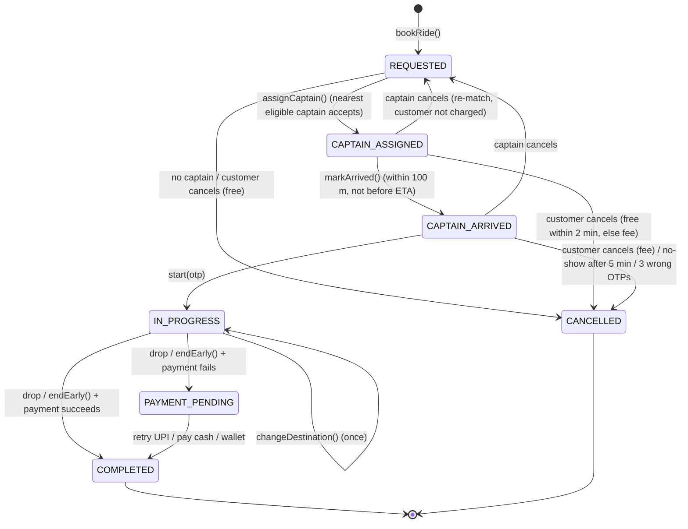

# Chennai Ride App: a Rapido-style app in pure OOP Java

A bike/auto/cab ride-hailing app that runs one **realistic simulated day in Chennai**. It is built to teach core OOP (classes and objects, encapsulation, abstraction, inheritance, polymorphism, composition) to students who already know the theory.

- Plain Java 17 standard library only. No frameworks, no build tools, no JUnit.
- Deterministic: every run prints exactly the same output (seeded `Random`, simulated clock).
- Consistent state all day: no teleporting, no double-booking, no time travel, no money appearing or disappearing.

## Run it

You only need a JDK (17 or newer).

```bash
./build.sh            # compile into out/ and open the start-up menu
./build.sh --demo     # the scripted simulated day   (old form still works: ./build.sh demo)
./build.sh --check    # SelfCheck, 155 checks         (old form still works: ./build.sh check)
./build.sh --cli      # interactive mode
./build.sh all        # the day, then SelfCheck
```

On Windows: `build.bat`, `build.bat --demo`, `build.bat --check`, `build.bat --cli`, `build.bat all`.

Start-up menu: `1` full simulated day · `2` interactive mode · `3` self-check · `0` exit.

Manually:

```bash
javac -encoding UTF-8 --release 17 -d out $(find src -name '*.java')
java -cp out com.ridehailing.app.Launcher            # start-up menu (also: --demo, --check, --cli)
java -cp out com.ridehailing.app.ChennaiRideApp      # the scripted day directly
java -cp out com.ridehailing.check.SelfCheck         # SelfCheck directly
```

## Package layout

```
src/com/ridehailing
  model/common      Money, Location, ServiceArea, ChennaiPlaces
  model/user        User (abstract), Customer, Captain, CaptainStatus
  model/vehicle     Vehicle (abstract), Bike, Auto, Cab (abstract), CabEconomy, CabPremium, VehicleType
  model/ride        Ride, RideStatus, RideRequest, FareEstimate, FareReceipt, CancellationReason,
                    OutstandingFee, TimelineEntry
  model/payment     Payable (interface), UpiPayment, CashPayment, WalletPayment, PaymentMethod, PaymentStatus
  notification      Notifier (interface), SmsNotifier, PushNotifier, RideEvent
  service           CustomerService, CaptainService, MatchingService, RideService, FareService,
                    PaymentService, RatingService, EarningsService
  time              SimulatedClock
  exception         RideHailingException + 10 specific exceptions
  check             SelfCheck
  app               Launcher (entry point), ChennaiWorld (seeded world), ChennaiRideApp (the scripted day)
  cli               Menu (abstract), StartupMenu, MainMenu, CustomerMenu, CaptainMenu, OperationsMenu,
                    ClockMenu, ConsoleIO, CliSession, GoBackException, QuitException
walkthroughs/       replayable class sessions (.txt) + teacher notes (.md)
```

Teaching material:

- [docs/OOP_CONCEPT_MAP.md](docs/OOP_CONCEPT_MAP.md) maps every OOP concept to the exact class and method (the teaching script).
- [docs/FLOWS.md](docs/FLOWS.md) lists every real-world flow and the class and method that enforces it.

## Class diagram (inheritance + composition)



## Ride lifecycle (state diagram)



`Ride` has **no `setStatus()`**. Every arrow above is a method on `Ride` that checks the current status and throws `InvalidRideStatusException` for an illegal move.

## The simulated day (`ChennaiRideApp`)

5 customers (Priya, Divya, Arun, Lakshmi, Harish) and 12 captains (bikes, autos, cabs; Mani's KYC is still pending) go through 21 scenes from 6:00 AM to just after midnight:

| # | Time | Scene |
|---|------|-------|
| 1 | 6:00 AM | Captains go online at home; Mani (KYC pending) is rejected |
| 2 | 8:15 AM | Priya compares all fares, Velachery -> Guindy, bike, UPI, full receipt |
| 3 | 8:40 AM | Auto Chennai Central -> Egmore with 1.4x peak hotspot surge, cash; captain's dues grow |
| 4 | 9:10 AM | **Canonical**: cab Egmore -> Tambaram; next Egmore request goes to another captain; Chromepet request goes to the captain now at Tambaram |
| 5 | 10:00 AM | Nearest captain rejects (trip too long for him), next-nearest accepts; offer sequence printed |
| 6 | 10:30 AM | Customer with an active ride tries to book again: rejected |
| 7 | 11:00 AM | Free cancel within 2 minutes; ₹20 fee after the grace period |
| 8 | 12:30 PM | Captain waits 4 min (₹1 charged); receipt also carries the ₹20 fee from scene 7 |
| 9 | 1:00 PM | Customer no-show after 5 minutes |
| 10 | 2:00 PM | One wrong OTP then correct; separately 3 wrong OTPs auto-cancel |
| 11 | 3:30 PM | Captain accepts then cancels; re-matched; customer not charged |
| 12 | 5:45 PM | Destination changed mid-ride; fare follows the actual route |
| 13 | 6:30 PM | Trip ended early on OMR; partial fare; both locations move to the stop point |
| 14 | 7:00 PM | Wallet too low, UPI fails (bank outage), PAYMENT_PENDING, booking blocked, cash, booking succeeds |
| 15 | 7:50 PM | Captain's cash dues cross ₹500: blocked for cash rides, settles, unblocked |
| 16 | 9:00 PM | No Cab Premium near Sholinganallur |
| 17 | 11:30 PM | Cab Premium Airport -> Anna Nagar: night charge, FIRSTRIDE, no-show fee from scene 9, wallet |
| 18 | 11:53 PM | Booking to Mahabalipuram rejected (outside service area) |
| 19 | 11:54 PM | Captain tries to go offline mid-ride: rejected; offline after the drop |
| 20 | 12:01 AM | Ratings; rating a cancelled ride rejected; a captain flagged below 4.0 |
| 21 | 12:01 AM | Earnings table, leaderboard, ride histories, final board, **Books Balanced ✔** |

Rides overlap like a real day. A ride that is not the focus of a scene runs on "autopilot": as the clock moves forward, its captain arrives, the trip starts, ends and is paid at the right minute. Every console line carries the simulated time.

## Interactive mode

Drive the app live in class, one action at a time. You can act as a customer, a captain or the operations team.

```bash
./build.sh --cli                  # or ./build.sh, then choose 2
```

It starts a **fresh copy of the demo's seeded world**: the same 5 customers and 12 captains at their home areas, with the clock at **6:00 AM** and 11 captains online (Mani's KYC is pending). The seeds are the same too, so OTPs and UPI outcomes are reproducible. Before every menu you see a status line:

```
[ 08:15 AM | Peak hour | Active rides: 2 | Online captains: 11 | Mode: Manual captain ]
```

### Menu map

```
Start-up menu ─┬─ 1 Run full simulated day (demo)
               ├─ 2 Interactive mode ── Main menu
               ├─ 3 Run self-check        ├─ 1 Customer app   (pick a customer)
               └─ 0 Exit                  │     1 View profile          8 End trip early
                                          │     2 Top up wallet         9 Pay pending ride
                                          │     3 See fare estimates   10 Rate last completed ride
                                          │     4 Book a ride          11 Ride history
                                          │     5 Track active ride    12 Switch customer
                                          │     6 Cancel ride          13 Travel on your own (metro / walk)
                                          │     7 Change destination
                                          ├─ 2 Captain app    (pick a captain; ● = ride offer waiting)
                                          │     1 View profile          7 Cancel ride / customer no-show
                                          │     2 Go online / offline   8 Today's earnings
                                          │     3 View incoming offer   9 Settle cash dues
                                          │     4 Mark arrived         10 Rate customer
                                          │     5 Start ride (OTP)     11 Switch captain
                                          │     6 Complete ride
                                          ├─ 3 Operations dashboard
                                          │     1 Captain position board   5 Notification log
                                          │     2 Live rides               6 Earnings & books reconciliation
                                          │     3 Nearby captains ✔/✘      7 Flagged / cash-blocked captains
                                          │     4 Surge at hotspots
                                          ├─ 4 Clock controls
                                          │     1 Show time  2 Advance N minutes  3 Jump to HH:MM
                                          │     4 Advance to the next ride event (Auto captain rides)
                                          └─ 5 Settings: captain mode Manual / Auto
```

- **Manual captain (default):** a booking waits on the captain's phone. Switch to the Captain app to accept or reject, mark arrived, type the OTP and complete the ride, so the class sees both sides of the app.
- **Auto captain:** the captain accepts at once, drives over and starts with the OTP. The trip ends when you move the clock past the drop time. You act only as the customer.
- Marking arrival and completing a ride move the clock by the real travel time. Moving the clock by hand is how you show the grace period, waiting charges, no-shows and the night charge. The clock never goes backward.

**Input rules:** type a number, or part of a place name (`tam` → Tambaram, `cent` → Chennai Central). `?` lists the places; Mahabalipuram and Kanchipuram are listed as "(outside service area)" for the rejection demo. At any prompt `b` goes back and `q` quits (after confirmation). Bad input just re-prompts. Every business error prints as a single `✘` line; the app never shows a stack trace.

**No business logic in the CLI.** Menus only read input, call existing service methods and print. The CLI needed a few small, clean service methods, which the scripted demo can use too:

- `RideService.respondToOffer`, `findPendingOfferFor`, `cancellationFeeIfCancelledNow`, `getActiveRides`, `findRide`, `currentSurge`, `setDispatchMode`
- `MatchingService.nextCandidate`
- `CaptainService.countOnline`
- `RideAutopilot` (moved out of the demo)
- `NotificationLog`

### Class walkthroughs (replay a live session)

```bash
./build.sh --cli < walkthroughs/01_egmore_to_tambaram.txt      # Windows: build.bat --cli < walkthroughs\01_egmore_to_tambaram.txt
./build.sh --cli < walkthroughs/02_cancellation_and_fee.txt
./build.sh --cli < walkthroughs/03_payment_pending.txt
./build.sh --cli < walkthroughs/04_night_ride.txt
```

When input comes from a file, each answer is echoed after its prompt, and `#` lines are printed as narration. The replay reads like a live session and exits cleanly at the end of the file. Each `.txt` has a matching `.md` with what to show students at each step:

| File | Shows |
|---|---|
| `01_egmore_to_tambaram` | Manual captain: offer → accept → arrive → OTP → complete; nearby captains at Egmore (Senthil ✘ 24 km) vs Chromepet (✔) |
| `02_cancellation_and_fee` | Free cancel in the grace period, ₹20 after it, "Previous cancellation fee" on the next receipt |
| `03_payment_pending` | Wallet too low → UPI outage → PAYMENT_PENDING → booking blocked → cash → booking works |
| `04_night_ride` | 23:30 Airport → Anna Nagar Cab Premium: night charge + FIRSTRIDE coupon |

## Classroom exercise

Rapido **Parcel** is intentionally *not* built. Add it by extending the existing classes: a new `VehicleType`, a parcel request, and different fare/validation rules. You shouldn't need to change `RideService`'s flow.
